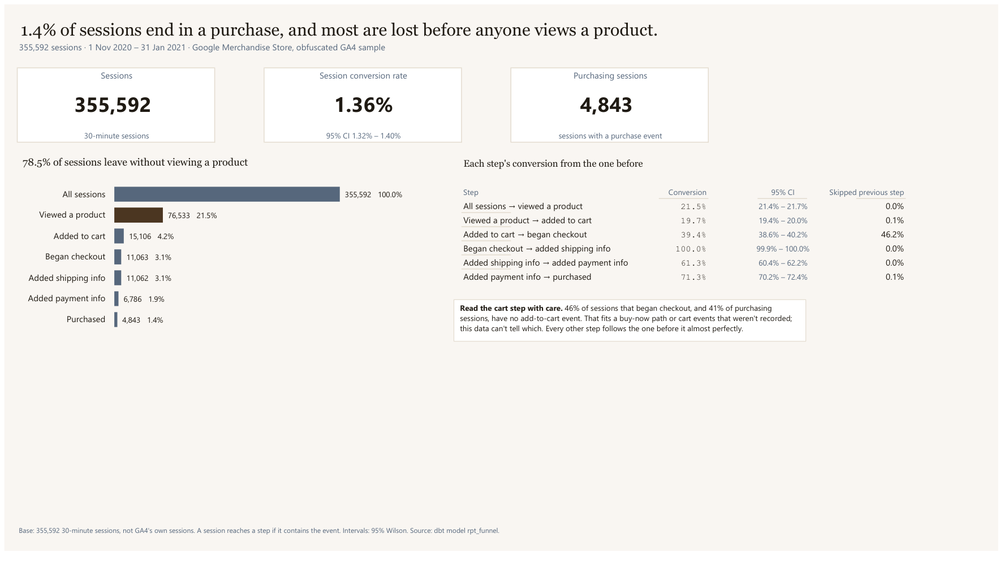
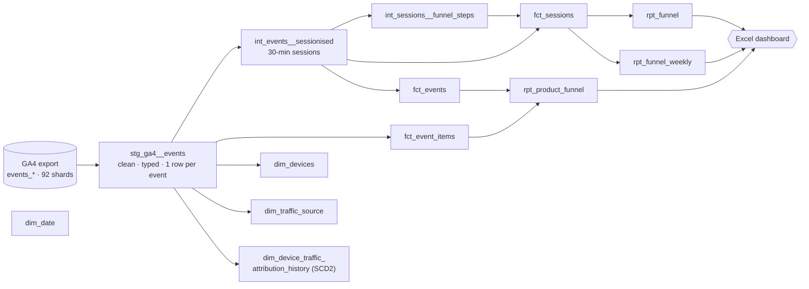
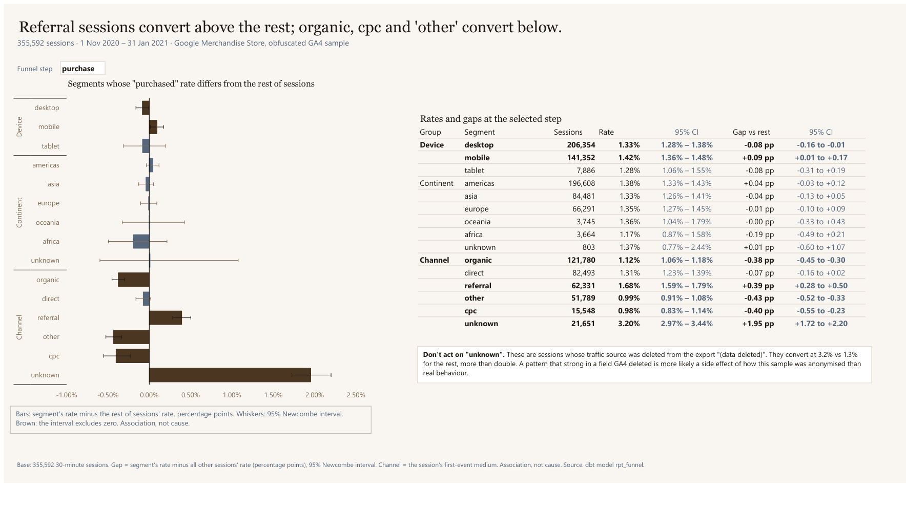
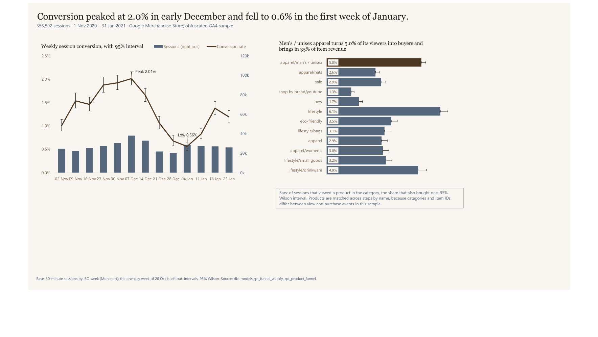

# GA4 e-commerce funnel: a dbt pipeline from raw events to a tested dashboard

**78.5% of sessions on the Google Merchandise Store leave without viewing a
product, and only 1.4% end in a purchase. The data behind those numbers needed
fixing before it could be trusted, and that's what this project is about.**




## At a glance

- **The question:** where do sessions drop out between landing and purchase, and for which devices, regions and channels?
- **What I found:** 1.36% of sessions purchase (95% CI 1.32–1.40%). The biggest loss is before the funnel starts: 78.5% never view a product. Referral sessions convert 0.39 pp above the rest; organic, cpc and "other" about 0.4 pp below.
- **What I built:** a layered dbt project on BigQuery (staging → intermediate → marts → reports), 13 models with 75 data tests, 3 custom macros, a semantic layer with 21 metrics, a parity test guarding the dashboard's numbers, and a three-page Excel dashboard over Power Query.
- **Data:** Google's public GA4 obfuscated sample (`bigquery-public-data.ga4_obfuscated_sample_ecommerce`): 4,295,584 events in 92 daily tables, 1 Nov 2020 – 31 Jan 2021, 270,154 devices.

## What this project shows about how I work with dbt

**I check the data before trusting the SQL.** The first staging query I was
handed unnested `event_params` in the `FROM` clause. Profiling showed that
turns 4,295,584 events into 46,095,652 rows. I wrote a macro that reads
parameters with scalar subqueries instead, after confirming no event repeats a
key.

**I let tests and failed builds change the design.** The first incremental,
date-partitioned staging table built with 0 rows. The BigQuery sandbox
expires partitions 60 days after their date, which is every partition in a
2020 sample. I traced it, rebuilt staging as a plain table, and logged how to
restore partitioning once billing exists.

**I don't let a join look right by accident.** The product funnel first showed
0 purchases for the best-selling categories. Purchase events use a different
category taxonomy and different item IDs from view events; only product names
match (387 of 395). Products are now linked by name, and all $362,110 of
item revenue reconciles across the categories.

**I model what the data can support, and say so.** 46% of checkouts and 41% of
purchases have no add-to-cart event, so the funnel keeps that step but flags
it rather than pretending the steps nest. The SCD Type 2 snapshot is built and
documented, but labelled a demonstration, since a static sample has no
changes for a snapshot to catch.

**Every number on the dashboard is tested.** Rates and gaps come with 95%
intervals computed in SQL. `tests/assert_dashboard_parity.sql` fails loudly if
any figure in a title, tile or note drifts from the marts.

---

## The dbt project



| Layer | Models | What happens there |
| --- | --- | --- |
| **Staging** | `stg_ga4__events` | Reads the 92 daily shards through one wildcard source, filtered by `ga4_start_date` / `ga4_end_date` vars. Flattens nested fields, extracts event parameters through a macro, and turns GA4's placeholders (`(not set)`, `(data deleted)`, `<Other>`) into NULLs or clean labels. Drops 27 columns that are empty, constant or export artefacts, each one logged with its count. |
| **Intermediate** | `int_events__sessionised`, `int_sessions__funnel_steps` | Builds sessions from 30 minutes of inactivity per device (window functions, a deterministic tie-break), then flags which funnel steps each session reached. |
| **Marts** | `fct_sessions`, `fct_events`, `fct_event_items`, `dim_devices`, `dim_traffic_source`, `dim_date`, `dim_device_traffic_attribution_history` | A star schema: facts carry keys and measures, dimensions carry labels. Surrogate keys via `dbt_utils`; every foreign key has a `relationships` test. |
| **Reports** | `rpt_funnel`, `rpt_funnel_weekly`, `rpt_product_funnel` | Pre-aggregated, chart-ready tables for the dashboard, with every rate's 95% interval already computed. |

### Macros

- `ga4_event_param(key, type)`: pulls one value out of GA4's `event_params` array without multiplying rows; fails at compile time on an unknown type.
- `ga4_clean_string(column)`: lower-cases a GA4 dimension, turns its "no value" placeholders into NULL and unwraps bracketed labels (`(direct)` → `direct`).
- `wilson_bound` / `newcombe_bound`: 95% confidence intervals in SQL, matching `statsmodels` to six decimals (checked).

**Testing.** Generic tests on every key (`unique`, `not_null`, `relationships`,
`accepted_values` with `quote: false` on integer flags), a multi-column
uniqueness test on the report grain, and the dashboard parity test (severity
warn). Fusion's `static_analysis: strict` compiles every model against the
warehouse schema, so type errors fail before anything runs.

**Semantic layer** (dbt v2 spec). Semantic models are declared on `fct_sessions`,
`fct_events`, `dim_devices` and `dim_traffic_source`, with `dim_date` as the time
spine. There are 21 metrics: sessions, devices, events, events per session,
average session duration, and sessions reaching / reach rate for every funnel
step, ending in session conversion rate.

**SCD Type 2, twice.** `dim_device_traffic_attribution_history` derives
attribution versions from event time (gaps and islands: 345,700 versions across
270,154 devices) and builds and tests on this data. A dbt snapshot (check
strategy, Type 2 columns renamed to `valid_from` / `valid_to`) shows the
production pattern. It's disabled here because the sandbox blocks the `MERGE`
it needs, and because a static sample gives it nothing to capture.

Every modelling choice, with its reason and what was deliberately not done, is
in the [decision log](docs/decision_logs.md).

---

## The dashboard

Three pages in Excel, loaded through Power Query from the `rpt_` models
([workbook](reports/ga4_funnel_dashboard.xlsx), [PDF](reports/ga4_funnel_dashboard.pdf),
[build notes](docs/excel_dashboard_plan.md)).

| Page | What it answers |
| --- | --- |
| **1 Funnel** | How many sessions reach each step, and where the biggest loss is |
| **2 Leaks** | Which devices, continents and channels convert above or below the rest, at any step (a selector cell drives the page) |
| **3 Time & Products** | How conversion moved week by week, and which product categories turn viewers into buyers |





### How the dashboard's numbers are calculated

All calculations happen in dbt (`rpt_funnel`, `rpt_funnel_weekly`,
`rpt_product_funnel`). Excel only plots them. The base throughout is
**355,592 sessions**: a session is a device's run of events with no gap longer
than 30 minutes. It's not GA4's own session.

**Reaching a step.** A session reaches a step if it contains that event at all
(`view_item`, `add_to_cart`, `begin_checkout`, `add_shipping_info`,
`add_payment_info`, `purchase`). Each is a 0/1 flag per session, so summing a
flag counts sessions and averaging it gives the rate.

**Reach rate** (page 1 bars, page 2 table): the share of all sessions in the
group that reached the step.

```math
\text{reach rate} = \frac{\text{sessions reaching the step}}{\text{sessions in the group}}
```

**Step conversion** (page 1 table): of the sessions that reached the previous
step, the share that also reached this one. The numerator counts sessions that
reached *both* steps, so it's always a true proportion, even where some sessions
skip a step.

```math
\text{step conversion} = \frac{\text{sessions reaching both the previous step and this one}}{\text{sessions reaching the previous step}}
```

**Skipped previous step** (page 1 table): the share of sessions reaching a step
that never reached the step before it. It's near 0% everywhere except
add-to-cart → checkout (46.2%), which is why the cart step is flagged.

**95% Wilson interval** (every rate). For *k* successes out of *n* sessions,
with *p* = *k*/*n* and *z* = 1.96:

```math
\frac{p + \frac{z^2}{2n} \pm z\sqrt{\frac{p(1-p)}{n} + \frac{z^2}{4n^2}}}{1 + \frac{z^2}{n}}
```

Unlike the textbook *p* ± 1.96·√(*p*(1−*p*)/*n*), it stays inside 0–100% and
holds up for small groups and rare events like purchases.

**Gap vs the rest** (page 2 chart): a segment's reach rate minus the reach
rate of every *other* session.

```math
\text{gap} = p_{\text{segment}} - p_{\text{rest}}
```

The comparison is with "the rest", not the overall average, because a segment
is part of the overall total. Comparing it with the rest keeps the two groups
independent, which the interval needs.

**95% Newcombe interval** (page 2 whiskers). Built from the two groups' Wilson
intervals (*l*, *u*):

```math
\text{lower} = d - \sqrt{(p_1 - l_1)^2 + (u_2 - p_2)^2}, \qquad
\text{upper} = d + \sqrt{(u_1 - p_1)^2 + (p_2 - l_2)^2}
```

A bar is brown when its interval doesn't cross zero. That means the segment's
difference from the rest is larger than chance would explain. It's still
**association, not cause**.

**Weekly conversion** (page 3 line): purchasing sessions ÷ sessions per ISO week
(Monday start), with its Wilson interval. The one-day first week (26 Oct, the
sample starts on a Sunday) is left out.

**Category view-to-purchase** (page 3 bars): of the sessions that viewed a
product in a category, the share that also bought a product in that category.
Products are matched across steps by name, and each product takes the
category it most often carries on view events. Category labels and item IDs
differ between view and purchase events in this sample.

**Thin cells.** Any group under 100 sessions is flagged and labelled "(thin)".
Its rate is shown, but it isn't allowed to carry a claim on its own.

### Caveats

- **Obfuscated sample.** Google scrambled this data for public release. The
  "unknown" channel (traffic source deleted from the export) converts at 3.2%,
  more than double the rest. That's flagged on the dashboard as a likely
  anonymisation artefact, not something to act on.
- **The add-to-cart step doesn't nest.** That could be a buy-now path or cart
  events that weren't recorded; the data can't tell which.
- **Association, not cause.** Segment gaps say where sessions convert
  differently, not why.

---

<details>
<summary><strong>Run it yourself</strong></summary>

1. Install dbt Fusion (see `requirements.txt` for the command) and, optionally,
   a Python venv: `pip install -r requirements.txt`.
2. Copy `profiles.example.yml` into `~/.dbt/profiles.yml` under the key
   `ga4_ecommerce`, pointing at a GCP project with BigQuery access. The source
   data is public.
3. `dbt deps && dbt build`. On the BigQuery sandbox the snapshot chain stays
   disabled; see the decision log for enabling it with billing.
4. Open `reports/ga4_funnel_dashboard.xlsx` and refresh. The Power Query
   connection string is in [docs/excel_dashboard_plan.md](docs/excel_dashboard_plan.md).

</details>

<details>
<summary><strong>Repository layout</strong></summary>

```text
models/
  staging/        stg_ga4__events + source declaration
  intermediate/   sessionising, funnel flags (+ disabled snapshot input)
  marts/          fct_ / dim_ / rpt_ models, exposures, semantic models in the YAMLs
macros/           ga4_event_param, ga4_clean_string, confidence_intervals
snapshots/        SCD2 snapshot (disabled on the sandbox)
tests/            assert_dashboard_parity
docs/             decision log, dashboard build notes, SIGNAL framework, images
reports/          the Excel dashboard and its PDF export
```

</details>

---

## About me

I'm **Adejori Eniola Emmanuel**, a data analyst who builds the pipeline as well
as the analysis, and tests the numbers before anyone sees them.

**[Live project site](https://adatamage.github.io/Ga4-funnel-analysis/)** · **[Repository](https://github.com/aDataMage/Ga4-funnel-analysis)** · **[GitHub profile](https://github.com/aDataMage)**
